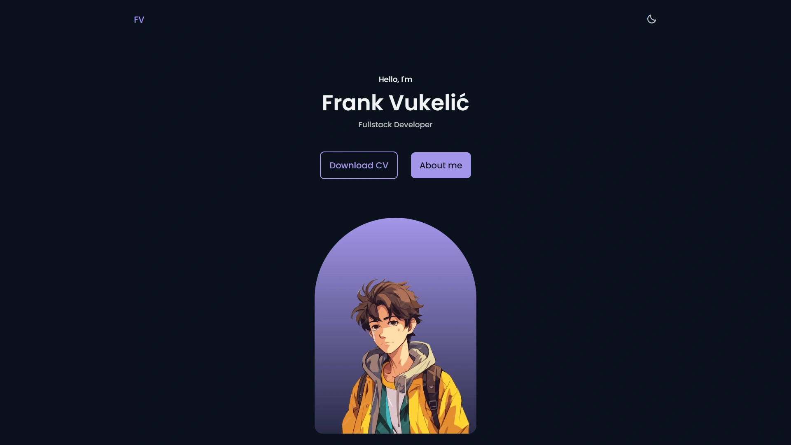

<div align="center">
    <a href="https://portfolio-v2js-fv.netlify.app" target="_blank">
      
    </a>
  <h3 align="center">Portfolio v2 - JS</h3>
</div>

##  <br /> 📋 <a name="table">Table of Contents</a>

- ✨ [Introduction](#introduction)
- ⚙️ [Tech Stack](#tech-stack)
- 📝 [Features](#features)
- 🚀 [Quick Start](#quick-start)

##  <br /> <a name="introduction">✨ Introduction</a>

**[EN]** Modern and minimalist portfolio website crafted using HTML, CSS, and JavaScript. Features smooth animations powered by the ScrollReveal.js library, a responsive carousel implemented with the Swiper.js library, and dynamic filtering and sorting with the MixItUp library to enhance user experience.

**[FR]** Site web de portfolio moderne et minimaliste conçu avec HTML, CSS et JavaScript. Comprend des animations fluides avec la bibliothèque ScrollReveal.js, un carrousel réactif implémenté avec la bibliothèque Swiper.js, ainsi qu'un filtrage et un tri dynamiques avec la bibliothèque MixItUp pour améliorer l'expérience utilisateur.

##  <br /> <a name="tech-stack">⚙️ Tech Stack</a>

- HTML
- CSS
- JavaScript
- [Sass](https://sass-lang.com/documentation/)
- [ScrollReveal.js](https://scrollrevealjs.org/guide/installation.html)
- [Swiper.js](https://swiperjs.com/get-started)
- [MixItUp](https://github.com/patrickkunka/mixitup/)


## <br/> <a name="features">📝 Features</a>
👉 Modern and minimalist design

👉 Crafted using HTML, CSS, and JavaScript

👉 Fully responsive with media queries

👉 Smooth animations powered by ScrollReveal.js

👉 Responsive carousel 

👉 Dynamic filtering and sorting system 

👉 Showcases portfolio projects effectively


## <br /> <a name="quick-start">🚀 Quick Start</a>

Follow these steps to set up the project locally on your machine.

<br/>**Prerequisites**

Make sure you have the following installed on your machine:

- [Git](https://git-scm.com/)
- [Node.js](https://nodejs.org/en)
- [npm](https://www.npmjs.com/) (Node Package Manager)

<br/>**Cloning the Repository**

```bash
git clone {git remote URL}
```

<br/>**Running the Project**

Use [Live Server](https://marketplace.visualstudio.com/items?itemName=ritwickdey.LiveServer)
to launch a development local server with live reload feature for static & dynamic pages.